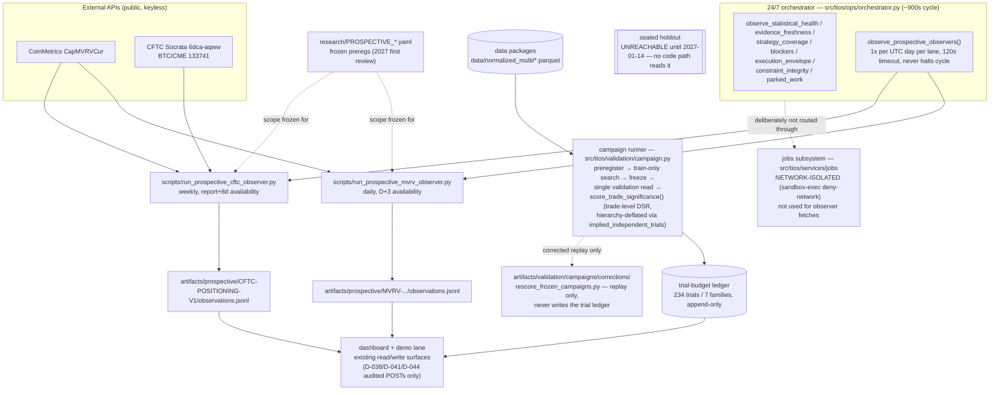

# AD — Architecture Decisions: Trading Intelligence OS

Status: Canonical architecture document v1, S2 architecture lock applied (2026-07-10).
Maturity labels used throughout: **[APPROVED]** (backed by decision log / this planning pass with evidence), **[PROVISIONAL]** (best current direction; may change on prototype evidence), **[UNRESOLVED]** (explicitly awaiting evidence — the required proof is named).
Authority: subordinate to the SSOT (`handoffs/START_HERE_SINGLE_CODING_AGENT_PROMPT.md`) and `TRADING_OS_NORTH_STAR.md`. This document does not authorize implementation; it prevents rediscovery.
Evidence base: package research (2026-07-05) + refreshed web research (2026-07-06) in `research/EXISTING_CAPABILITY_REGISTRY.md` (cited as REG §n) and `research/RESEARCH_GAP_MATRIX.md` (RG-nn), plus retained S1 evidence accepted by D-036 in `decisions/PROTOTYPE_EVIDENCE_DECISION.md` (cited as S1 decision), `artifacts/reports/ENGINE_BAKEOFF_REPORT.md`, and `artifacts/reports/LINEAGE_PROTOTYPE_REPORT.md`.

---

## A. Executive architecture summary

- **Purpose**: a self-measuring machine for discovering, rejecting, validating, approving, monitoring, degrading, and retiring trading edges — measuring its own tools, models, agents, and research assets along the way (North Star §2).
- **Philosophy**: composable reuse around a custom evidence spine. Engines, trackers, indicator libraries, dashboards are replaceable commodities behind ports; the durable custom core is the Trading Evidence Registry + approval/provenance semantics (North Star §15, D-009, D-016).
- **S2 boundary**: Crypto Spot, BTCUSDT/ETHUSDT, 5m/15m/1h, historical research→validation evidence pipeline and a bounded console with exactly three audited POST exceptions. The paper runtime is implemented but dormant and gate-bound; no paper state or bot is active. See `docs/product/MVP_SCOPE.md` and the S2 plan.
- **Corrective boundary note (D-046)**: retained authenticated Bybit demo activity was
  an out-of-architecture governance probe, not an approved capability. Its standalone
  scripts are now fail-closed and network-quarantined. Current execution authority and
  venue connection remain `NONE`; any future demo use still requires the complete
  recorded gate, validation, security, and venue-approval predicate.
- **Long-term boundary**: multi-market (perps, US equities/ETFs), paper→limited-live under human gates, full 27-page console, evidence-routed AI.
- **Non-goals**: universal bot, single score, AI-in-live-path, architecture for its own sake (North Star §17).
- **Core risks**: overfitting theater, cost-model optimism, leakage, engine semantic mismatch, AI hallucination provenance, single-operator maintenance ceiling (North Star §18; red team in `audits/RED_TEAM_PLAN_REVIEW.md`).

## B. Architecture principles

1. **Reuse before build** [APPROVED, D-002] — custom code requires a failed reuse case (Custom Build Gate §AL).
2. **Modular monolith over services** [APPROVED for S2] — one local application boundary (CLI plus projection-first dashboard with exactly three audited POST exceptions) with ports/adapters and per-engine isolated subprocess environments. S1 completed on one operator machine without evidence requiring service boundaries; extraction requires a later measured contention or multi-host need and preserves the ports.
3. **Ports and adapters + dependency inversion** [APPROVED as design law] — MODULE_CATALOG dependency rules; enforced by architecture tests.
4. **Deterministic vs non-deterministic boundary** [APPROVED] — §H; AI never inside deterministic execution paths.
5. **Immutable evidence, append-only history** [APPROVED] — supersession over mutation for all evidence-bearing records (type catalog §0).
6. **Replaceable externals** [APPROVED] — domain stores only public stable refs to trackers/engines (lineage prototype "replaceability" gate).
7. **Idempotency & reproducibility** [APPROVED] — content-addressed inputs; jobs at-least-once + idempotent effects (type catalog §5).
8. **Point-in-time correctness** [APPROVED] — no feature availability before its timestamp; G4 gates; time-aware corpora for AI benchmarks (D-021).
9. **Fail-closed** [APPROVED for anything touching capital or approval state; fail-open permitted only for read-only views].
10. **No strategy-owned risk authority** [APPROVED, North Star §4.3]; **no hidden AI decisions** [APPROVED, §H/§T]; **no live execution without human approval** [APPROVED].

## C. System context

Actors/systems: Operator (sole human; approver of HG gates) · Coding agent (R7, SSOT-bound) · AI providers (future adapter boundary; S2 remains null/mock only) · Research/strategy sources (untrusted input; ingestion workflow) · Exchanges (public historical data only in S2; future venue candidates remain outside the boundary) · Market-data vendors (deferred tiers, D-018) · Future paper environments (not authorized) · Future live environments (S4, not authorized) · Local machine (macOS ARM; primary) · Optional cloud (none in S2) · Storage (local FS + Git + SQLite operational DB).

Trust boundaries: (1) everything fetched from the internet is untrusted data — prompt-injection surface (§AB); (2) S2 Research Lab uses null/mock AI only; any later provider API requires a separate credential intake; (3) no exchange, demo, testnet, sandbox, paper, or live credential exists in S2.

D-046 preserves the intended trust boundary after historical drift: demo evidence may
exist in retained artifacts, but no approved or reachable demo credential/network/order
path exists in the current architecture.

## D. Bounded contexts

Consolidated from the mandate's candidate list — merged where cohesion demands, deferred where MVP doesn't touch them. [APPROVED as boundaries; internals PROVISIONAL]

| Context | Owns | MVP | Notes on merges |
|---|---|---|---|
| **Market Data** | datasets, quality, freeze identity | thin (WS2) | "Data Center" IA page maps here |
| **Strategy** | specs, versions, families | yes | includes Strategy Definition + Versioning (split was artificial) |
| **Ingestion** | sources, licenses, extraction lifecycle | bounded S2 | primary-source registration/refresh and hypothesis proposals; claims remain untrusted inputs |
| **Experimentation** | experiments, runs, trials, lineage refs | yes | Backtesting execution lives here; engines are adapters, not a context |
| **Validation** | gates G1–G12, packages | yes | |
| **Evidence & Approval** | EV records, approval state machine, promotion governance | thin | Approval Governance + Evidence merged: approval is meaningless without evidence rows |
| **Knowledge** | dictionary concepts, research assets, ResearchSource/Hypothesis registry, ecosystem library | bounded S2 | same storage/provenance pattern; split later only if scale demands |
| **AI Measurement** | model/agent/prompt registries, benchmarks, cost, routing evidence | harness+fixtures | Task Router deferred to S2 (needs benchmark evidence first) |
| **Memory** | evidence-linked learnings | thin | |
| **Operations** | jobs, schedules, reports, dashboard | thin + bounded audited controls | Reporting + Ops merged for MVP; exactly three allowlisted POST exceptions (D-038/D-041/D-044) |
| Paper/Bot Operations | bot lifecycle, divergence tracking | **implemented dormant; activation deferred S3** | confined local runtime exists but requires HG-3 + a validation-approved strategy context; no active bot/state |
| Live Trading, Portfolio, Risk Center | — | **execution deferred S3/S4** | S2 has inert historical projections and risk/approval preconditions only |

Prohibited responsibilities are inherited from MODULE_CATALOG (e.g., Validation never promotes; Strategy never owns risk).

## E. Module map

Canonical in `docs/architecture/MODULE_CATALOG.md` (18 modules, dependency law, tests, MVP status). [APPROVED at boundary level]

## F. Repository architecture

**[APPROVED for S2] Monorepo.** One repository contains the OS package tree, engine adapter envs, specs/docs, and artifact manifests (large artifacts outside Git; hashes inside — SSOT WS1). S1 retained all evidence and isolated engine environments without a coordination or ingestion-volume reason to split repositories. A later split must identify a measured independent lifecycle/ownership need and preserve the same ports and artifact identities.

```text
repo/
├── (existing planning package files — unchanged locations)
├── src/tios/            # modular monolith per MODULE_CATALOG
│   ├── core_types/  dataset/  strategy/  experiment/  validation/
│   ├── evidence/  approval/  knowledge/  ai_eval/  memory/
│   ├── adapters/{freqtrade,nautilus,lean,hummingbot,vectorbt,lineage}/
│   ├── services/{jobs,ingestion,reporting,dashboard_api}/
│   └── security_ops/
├── engines/<name>/      # isolated per-engine envs (venv/Docker) — RG-04
├── data/{raw,normalized}/   # gitignored payloads, tracked manifests
├── artifacts/           # SSOT WS1 evidence tree (reports tracked; large files hashed)
├── fixtures/            # test datasets per TEST_MASTER_PLAN §2
└── tests/
```
Dependency direction: `src/tios` never imports from `engines/`; engine invocation is subprocess/CLI/API via adapters (also the GPL/AGPL license boundary — REG §1).

## G. Application architecture [APPROVED for S2]

S2 has **one local CLI/application boundary** for research operations and **one projection-first bounded dashboard process** (API+UI) with the D-038/D-041/D-044 audited POST exceptions. The first Research Lab runner is a bounded deterministic command in the monolith. Its persisted local job table and scheduler were added only after the same command passed the idempotency contract in §S; they are not separate services. Separate research/backtest/validation workers, ingestion services, and distributed orchestration remain rejected because S1 produced no multi-process or multi-host requirement.

## H. Deterministic vs non-deterministic boundary [APPROVED — mandatory]

| Class | Examples | Rules |
|---|---|---|
| Deterministic functions | normalization, gates G1–G9, fee math, parity alignment | pure; content-addressed; golden-testable |
| Stateful deterministic workflows | dataset freeze, experiment execution, approval transitions | idempotent jobs; append-only records |
| Stochastic research | parameter sweeps, walk-forward | seeded; seeds recorded; trials retained |
| AI-assisted workflows | extraction, synthesis, critique (R1–R6, R8) | outputs are *proposals* entering via intake commands with provenance; never direct writes |
| Agentic implementation | R7 coding agent | SSOT-bound; verification discipline §6 of SSOT |
| Human approvals | HG-1..5 | recorded decisions; non-delegable |

**AI is forbidden from directly controlling**: gate verdicts, approval transitions, evidence record mutation, dataset freezing, anything in a (future) order path. An AI output can *cause* those only by passing through deterministic validation + (where required) human decision. AI involvement class (North Star §11) is a mandatory field on every strategy; classes E/F are out of scope until explicitly approved (not in MVP/S2/S3).

## I. Trading lifecycle architecture [APPROVED]

State machine (entity: strategy-in-context, i.e., SV × market × instrument × timeframe × environment):

```text
IDEA → HYPOTHESIS → SPEC(canonical) → STRATEGY_VERSION → EXPERIMENT(s) → BACKTESTED
  → VALIDATION_PACKAGE → {REJECTED | PAPER_CANDIDATE}
PAPER_CANDIDATE → (HG) PAPER_APPROVED → PAPER_ACTIVE → {DEGRADED|PAUSED|...}
PAPER_ACTIVE → (S3 evidence + HG-5) LIMITED_LIVE_REVIEW → ... → RETIRED
```
Transition gates: SPEC requires validator PASS; BACKTESTED requires G1–G3; PAPER_CANDIDATE requires VAL package with zero hard-fails + red-team report; every LIVE-family transition requires human record. REJECTED/RETIRED are terminal but queryable (preserve failures, §4.4). Full gate table lives with the approval module spec (type catalog §2).

## J. Strategy architecture [APPROVED]

CanonicalStrategySpec is the framework-neutral center (type catalog §2): provenance (SRC refs, license), family, indicators, entry/exit rule trees, sizing, risk fields, execution assumptions, ambiguities, reproduction status. Engine implementations are *projections* of the spec via adapters; the spec, not any engine file, is the versioned identity. Public-source profitability never imports (D-011).

Research-only multi-leg hypotheses may additionally record shared eligibility and two or more
typed leg descriptions (instrument kind, `LONG|SHORT`, role, notional fraction, and explicit
execution assumptions). This representation carries no order semantics, requires
`execution_authority=NONE`, and is rejected by the long-only signal evaluator. Funding,
collateral, settlement, liquidation, and reconciliation remain separate evidence contracts.

## K. Engine adapter architecture [APPROVED for evidenced S2 roles]

Role-based composition (D-012), resolved by the S1 bake-off:

- **vectorbt — selected research accelerator** for bounded B2/B3/B4 parameter sweeps. It has no execution or approval authority; every trial is retained and binding overfit controls plus event-engine reproduction remain promotion preconditions.
- **Freqtrade — selected Crypto Spot event/reproduction lane** through CLI/subprocess only. Its B1–B4 evidence, fee audit, timing semantics, G4 warning, and slippage gap are retained; trade/dry-run and venue modes are prohibited in S2.
- **NautilusTrader — capability-supported bounded event-simulation lane** only. Deterministic, fee-audited B1–B4 evidence supports this role; full-history parity and latency/fill evidence are still gaps.
- **Hummingbot — bounded bot-operations capability/regression lane** only. BTCUSDT 30-day B1–B4 x `{F0/S0,F1/S1}` x `{run1,run2}` is normalized, fee-audited, and deterministic; full-history completion remains a throughput track, not a credential or approval blocker.
- **LEAN — bounded multi-asset portability candidate** only. Local Docker B1–B4 x `{F0/S0,F1/S1}` evidence is retained without QuantConnect cloud/account use; full-range parity remains a throughput/scope expansion.

No engine is a strategy selector, risk authority, approver, venue gateway, or universal engine. A bounded/deferred engine is invoked only for a capability-specific evidence task inside its retained scope, or after its recorded blocker is closed.
- Common contract: EngineAdapter port (type catalog §4). Semantic mismatches → CapabilityGap records + parity diagnosis (WS4).
- Version pinning: exact version/commit per run; upgrade requires golden parity rerun (type catalog §8).
- License boundary: Freqtrade GPL-3.0 → subprocess/CLI integration only, no code-linking; Nautilus LGPL-3.0 → import permissible, keep abstraction anyway; backtesting.py AGPL + Backtrader dead → rejected (REG §1).
- Exit strategy per engine: adapter deletion; normalized artifacts remain readable forever (normalization is ours).

## L. Converter architecture [APPROVED as design; implementations S1/S2]

| Converter | Source → Target | Lossy? | Ambiguity behavior | Validation | MVP |
|---|---|---|---|---|---|
| C1 external strategy → canonical spec | paper/Pine/Freqtrade/LEAN/Hummingbot/prose → STRAT | lossy (declared) | record in `ambiguities`, never guess | SKILL_CANONICAL_SPEC_VALIDATOR | WS7 (manual-assisted) |
| C2 canonical spec → engine config | STRAT → engine-native | lossy where engine can't express → CapabilityGap | refuse silently-approximating | parity tests | WS3 |
| C3 engine result → NormalizedResult | engine-native → canonical trades/equity/metrics | lossless target | unknown fields preserved in `semantic_notes` | golden tests + fee recomputation | WS3 |
| C4 venue symbol/timeframe → canonical | `BTCUSDT` → `BTC-USDT.BINANCE_SPOT` | lossless | unmapped → hard error | mapping-table tests | WS2 |
| C5 raw market data → canonical bars | source files → canonical schema | lossless + explicit derived versions for any fill/dedup | µs/ms timestamp-unit boundary handled explicitly (CG-03) | dataset quality gates | WS2 |
| C6 AI research output → Research Asset | agent output → RA record | lossy (curation) | contradictions preserved | human_review flag | S2 |
| C7 external glossary → concepts | FIBO/venue docs → CON | lossy | context variants kept separate | T7 benchmarks | S2 |
Each converter records: converter version, source hash, losses[], provenance (type catalog §4).

## M. Type system

Canonical in `docs/architecture/TYPE_AND_CONTRACT_CATALOG.md` §0–2. [APPROVED for S2 semantics and JSON serialization]. Key laws: decimal values cross JSON boundaries as strings; timestamps are UTC ISO-8601 in canonical `Z` or `+00:00` form, with only explicitly documented legacy Z-only fields remaining stricter; IDs are opaque; top-level payloads carry schema versions; value objects replace primitives; and evidence is append-only.

## N. Domain models and entities

Type catalog §2 defines identity/lifecycle/invariants for DS, SRC, STRAT/SV, HYP, EXP/RUN, VAL, EV, APR, RA, CON, MDL/AGT/PRM/BMK, LRN. [APPROVED]

## O. Contract architecture

Type catalog §3–8: commands, queries, events, adapter/converter/job/artifact/API contracts + versioning rules. [APPROVED as names/semantics]

## P. Data architecture [APPROVED for S2]

- Operational DB: **SQLite** in WAL mode for registries, read models, and the optional local job table. The S1 single-operator/local-first workload produced no evidence for PostgreSQL. PostgreSQL 18 becomes a migration candidate only when a representative workload records either (a) any operational write lost or failed after the configured SQLite busy-timeout/retry budget, (b) p95 write-transaction latency above 500 ms in three consecutive complete Research Lab batches, or (c) an approved multi-host/concurrent-writer requirement. The measurements and an ADR are required before migration; repository ports and replayable append-only records are the migration seam.
- Analytical: **Parquet + DuckDB** for frozen candles, trial populations, normalized engine results, scorecard inputs, and ad-hoc analysis. Operational rows contain identities/statuses/refs, not duplicated analytical payloads.
- Artifact storage: local FS under `artifacts/` with manifests + hashes (SSOT WS1); large files gitignored.
- Raw vs normalized market data: separate trees; raw immutable (dataset spec).
- Lineage: **MLflow + DVC behind the LineageAdapter ports**, selected by the seven-gate S1 prototype. MLflow owns generic run/artifact/comparison metadata; DVC owns immutable dataset snapshot/restore references; the domain stores only stable public refs and never either tool's internal keys or schema.
- Retention: no automatic deletion. All batch manifests, trials (including failed/aborted trials), MLflow run records/artifacts, DVC snapshot refs, evidence rows, and scorecards are retained indefinitely by default. A later pruning policy cannot make a retained domain record unrestorable and requires an explicit decision plus a superseding manifest.
- Backup/restore: the SQLite operational DB, MLflow metadata/artifact root, DVC remote, and artifact manifests form one backup set copied after each completed batch and before any tool/schema migration to a separate local volume/filesystem from the primary. A clean-checkout restore and hash/replay check is required before S2 exit and after lineage-store upgrades.
- Migration/access: migrations are versioned, backup-first, and must preserve public `run_ref`/`dataset_ref` values or record an adapter-level mapping without changing domain IDs. Lineage stores and their UIs bind to loopback and are operator-only in S2; no public network, cloud account, or shared write access is authorized.
- Search: SQLite FTS5 / PG tsvector for concepts+registry text (REG §9). Vector retrieval: **rejected for MVP** — no retrieval requirement exists yet (pgvector noted as future option, REG §5).
- Time-series DB: rejected for MVP; Parquet+DuckDB suffices at two instruments × three timeframes.

## Q. Dataset architecture [APPROVED — spec exists]

`specs/CANONICAL_BAKEOFF_DATASET_V1.md` + Amendment A1 per D-029 (µs timestamps in source files dated from 2025-01-01, CG-03). Identity: dataset_id + source files + SHA-256 set + normalization commit + coverage + quality-report hash. Licensing: Binance public data — free redistribution of derived hashes/manifests, raw files re-downloadable (record source URLs, don't redistribute payloads).

## R. Event architecture [APPROVED for S2]

Append-only event rows live inside the monolith; dashboard, reporting, and memory consume them as read models. Event names/payloads follow the type catalog. There is **no broker** in S2. Idempotency keys and per-entity ordering are required; failures remain visible. Revisit a broker only after an approved second-process/multi-host boundary exists and DB polling is measured insufficient.

## S. Workflow/job architecture [APPROVED for bounded S2]

The first runner is the allowlisted, offline `ResearchLabBatch` command defined in the type catalog: one content-addressed input set, bounded trial count/resources, deterministic identity, complete failure retention, and `execution_authority=NONE`. It must prove that rerunning identical complete inputs returns the same batch/artifact refs without recomputation before any schedule is enabled. Only then may a SQLite job table and local time trigger run allowlisted research, freshness, validation, and reporting jobs with bounded concurrency and per-engine subprocess isolation. D-096 adds a separate finite public-read-only observation service because a 30-day WebSocket continuity chain cannot fit the offline network sandbox or 24-hour job bound; it has fixed source code/arguments, immutable intent/checkpoints, stale detection, no auto-restart, and no job/dashboard process-control path. No broker, distributed executor, account connection, venue command, paper command, or live command is present. Prefect or another orchestrator is reconsidered only after sustained measured queue saturation or an approved multi-machine requirement.

For the same reason as D-096, the two v8.119 prospective-observer scripts (`scripts/run_prospective_mvrv_observer.py`, `scripts/run_prospective_cftc_observer.py`) are invoked directly by the 24/7 orchestrator's `observe_prospective_observers()` step (`src/tios/ops/orchestrator.py`, ~900s cycle, one subprocess call per lane per UTC day, 120s timeout) rather than through the `jobs` module: `jobs` is deliberately network-isolated (`sandbox-exec`) and these observers require a live outbound call (CoinMetrics, CFTC Socrata). A failing, timed-out, or missing observer script emits an ACT observation and never halts the cycle. See §AM for the full flow and diagram.

## T. AI model & agent architecture [APPROVED design; execution S1+]

Registries (MDL/AGT/PRM), benchmark suite (frozen V1), controlled/best-config/longitudinal modes, cost intelligence, provenance graph — all per `specs/AI_AGENT_EVALUATION_BLUEPRINT_V1.md` + `docs/ai/AGENT_ROLES.md`. 2026-07-06 adjustments (REG §7): (1) **no provider determinism** → stability scoring is multi-sample by design; (2) provider snapshot pinning policies differ → registry stores per-provider deprecation watch; (3) OpenAI Evals platform is not a dependency; (4) model degradation/outage → fallback route required before any config becomes a task-class default. S1 proved null/mock trace plumbing only. Real-provider runs and the Task Router remain outside S2 until credential authority and real benchmark evidence exist.

## U. Research asset and source architecture [APPROVED]

The application-owned `ResearchSource` registry records bibliographic identity, canonical URL/DOI, authors/date, access/license notes, claim summary, assumptions, review time, supersession, and reproduction status. Primary-source claims create explicit `Hypothesis` records; publication or original-sample profit never counts as local evidence. The autonomous evidence flow is `ResearchSource → Hypothesis → canonical strategy spec → ResearchLabBatch/EXP/RUN → multi-dimensional Scorecard → VAL/EV`, with ambiguities, contradictions, failures, and missing dimensions retained as blockers. RA lifecycle remains creation with full provenance/cost, human review flag, freshness states, contradiction/supersession chains, and consumer tracking.

External strategy acquisition is a core lab capability, not an execution shortcut. Approved source classes include academic papers, QuantConnect/library algorithms, Freqtrade strategies, Hummingbot V2 controllers, open-source TradingView/Pine scripts, exchange-hosted bot marketplaces such as Binance Trading Bots, third-party bot platforms, public strategy leaderboards, copy-trading/copy-investing records, and online signal feeds. Every such item enters only as untrusted research/source material: the OS may extract a canonical spec, reconstruct historical signals, or build a replayable hypothesis, but it may not copy, subscribe, mirror, or execute the source's trades. Source ingestion must record platform terms, source URL, author/provider, capture time, license/usage permission, parameter visibility, signal timestamp semantics, survivorship/selection bias risks, fee/slippage assumptions, and whether the source is a strategy definition, historical signal feed, portfolio allocation record, or black-box performance claim. For open-source TradingView/Pine strategies, Strategy Tester summaries may be retained only as external comparison evidence with symbol, timeframe, date range, capital, commission, slippage, net profit, drawdown, trade count, win rate, and profit factor; protected or invite-only script code is never copied or reverse-engineered.

Copy-trading, signal providers, exchange bot marketplaces, and working bot platforms are therefore future first-class inputs to the Research Lab and demo-wallet roadmap, but never direct trading authorities. Before any such source can influence paper/demo or live operation it must pass the normal path: source verification, canonicalization or replay capture, local backtest/replay on approved data, retained trial population, validation gates including multiple-testing and cross-engine checks where applicable, paper/demo divergence tracking, risk/security review, and the required human gates. If a platform exposes only opaque performance or leaderboard data without reproducible rules/signals, it can be retained as a research asset or allocation hypothesis, not as an approvable strategy.

## V. Dictionary/ontology architecture [APPROVED direction — evidence-backed]

Plain relational concept + alias + context-variant tables with FTS; **no graph DB, no RDF** at <10k concepts (REG §9: Kuzu archived, Memgraph BSL, Neo4j overkill; rdflib/Oxigraph adopted only if external linked-data interop materializes). Seed sources: FIBO (MIT, active) legally clean; copyrighted glossaries (Investopedia) are cite-only, never scraped. Venue/market context variants are first-class rows, not merged definitions. Dictionary ≠ strategy config (North Star §9.3).

## W. Memory & learning architecture [APPROVED]

LRN records only with evidence refs (invalid otherwise — type catalog §2); categories per North Star §9.10; contradiction storage first-class; freshness/invalidation triggers mandatory; no free-floating "AI memory".

## X. Scoring architecture [APPROVED]

Separate score families exactly as North Star §8 (strategy) and §10 (AI). Hard gates dominate scores everywhere (G-gates for strategies; critical-failure rule for models). No weighted average may override a hard fail; no single global score exists anywhere in the system — enforced by the reporting module's score-view contracts. Strategy eligibility is evaluated in three fail-closed layers: mathematical metric eligibility, governed scorecard eligibility, and promotion eligibility. Platform diagnostics, optimization objectives, leaderboard scores, and allocation ratings remain evidence inputs only. Promotion requires the exact G1-G11 set plus complete independent statistical, risk, supervisor, and security reviews; G12 remains the later paper-forward gate.

## Y. Approval architecture [APPROVED]

Contextual identity Strategy×Market×Instrument×Timeframe×Config×Environment (risk-tier dimension reserved). States per type catalog §2 (superset harmonizing North Star §9.7 and prototype spec names; mapping table maintained in approval module spec). Machine proposes with evidence; operator decides anything in the LIVE family; every decision carries evidence package + expiry/review rule.

## Z. Risk architecture [APPROVED design; build S2/S3]

Independent risk authority (never strategy-owned): global caps (capital, daily loss, drawdown), portfolio caps (correlation, concentration) [S3], strategy budgets, market-condition blocks (stale data, exchange health), kill switches (operator-manual first; automated triggers additive, never replacing manual). S2 scope is inert `RiskDecision` records plus validation/approval preconditions only—no runtime risk engine exists because nothing trades.

## AA. Demo, paper, and live boundary [APPROVED]

S2 operation is historical research only: `execution_authority=NONE`, `venue_connection=NONE`, `paper_orders=DISABLED`, and `live_orders=DISABLED`. Its Market/Signal/Order/Fill/Position/Portfolio/Risk/Approval records are inert historical/read-model contracts and expose no exchange client, credential, or order command. Dormant S3 local-simulator code may be present, but no paper account, bot, ledger store, or runtime state is initialized or active without the S3 predicates below. There is no demo/testnet/sandbox connection, Freqtrade trade/dry-run mode, credential-bearing venue adapter, order endpoint, stage-gate approval endpoint, or real-money command.

S3/S4 control-plane records and dormant local-simulator machinery may be implemented before activation. Stage-gate readiness, synthetic-local paper-lane proposals, and limited-live readiness proposals validate prerequisites, human-decision evidence, and risk-limit shape while keeping `execution_authority=NONE`, `venue_connection=NONE`, and all exchange paper/live order capabilities disabled. Merely importing or inspecting the runtime creates no paper store, wallet, account, bot, venue session, credential, approval transition, or order route. Local simulated fills, once gate-approved, are synthetic evidence rather than exchange orders.

Local `SYNTHETIC_LOCAL_SIMULATOR` activation remains disabled until **all** are true: S2 exit passes; an approved HG-3 stage-gate record exists; one matching strategy context has retained validation approval and evidence; and the D-043 paper-lane architecture decision exists. The local simulator uses synthetic capital, public market observations, and confined local state only: it has no credential, account endpoint, venue session, or order route. Venue demo/testnet connectivity additionally requires HG-4, a security review, operator approval of the specific integration, isolated venue credentials/state, and explicit synthetic-capital labeling. Any later limited-live review additionally requires S3 exit, quantified backtest-vs-paper divergence and the defined paper-stability period, an independent live risk/kill-switch and security package, a specific limited-capital/venue proposal, and explicit HG-5 operator approval. Live adapters and keys remain absent, and every LIVE-family transition is unreachable in S2. Missing any predicate keeps all execution controls absent and disabled.

**Stage B demo-evidence v2 sink boundary (D-117, implemented default-disabled, `NOT_ACTIVATED`)**: schema `tios.demo_decision_evidence.v2` is a NEW append-only decision-evidence chain, separate from and never upgrading or reusing the unchanged Stage A v1 chain or the immutable simulation `DecisionTrace` types. It is written by one fixed, non-pluggable, sanitized sink invoked only while the existing exclusive demo-lane lock is held, in the fake-money Bybit venue-demo lane. Storage is content-addressed, append-only, manifest-last generations (the manifest rename is the sole commit point) with a non-authoritative `HEAD.json` convenience pointer that never validates or invalidates a committed generation. Venue correlation uses a validated client key (`orderLinkId`, `^[A-Za-z0-9_-]{1,36}$`) persisted and `fsync`-verified before any risk-increasing POST and reused for realtime/history/execution reconciliation with `execId` deduplication; the raw key never enters the projection, dashboard, logs, or lane state. The sink is an evidence gate for risk-increasing submissions only: on evidence degradation the lane latches `EVIDENCE_DEGRADED` + `ENTRY_BLOCK` (exit-only, fail-closed), while a risk-reducing exit, protective-stop create/replace/cleanup, cancel, kill-switch, or reconciliation is always available and is owned by the durable lane-state protocol, never blocked by an evidence-store write. Disclosure is an aggregate-only, redacted dashboard projection over the unchanged `/api/v1/demo-lane` route under a global allowlist: it exposes only operational status plus completed, exact 30-episode cohort aggregates (`aggregate=null` until complete) and removes legacy per-trade, identifier, timestamp, wallet, position, signal, and free-text fields. Consistent with §H, the sink is deterministic and contains no AI; it cannot create, size, route, retry, cancel, or approve an order, change a strategy/risk/stop/lane decision, or acquire venue/credential/network capability. `execution_authority=NONE` and `real_money=false`; activation is separately gated per the 2026-07-23 Stage B security packet (verified-flat lane, controlled restart, `0700`/`0600` hardening, receipt and private alias material, rollback identity, and independent review) and is not authorized by implementation.

## AB. Security architecture [APPROVED design]

Per SSOT secret rules + intake gate: `.env`-only secrets, names-only `.env.example`, gitignore verification, no withdrawal-enabled keys ever requested, credential rotation procedure documented at intake, minimal key scopes. Dependency scanning + license compatibility in local gate (gitleaks/audit — verify tools at WS1). Untrusted-content rule: ingested strategy code never executes in-process; reproduction in isolated env without credentials/network where feasible; all fetched content is data, not instructions (prompt injection). AI tool permissions per role (AGENT_ROLES). Threat model review at each stage exit (SKILL_SECURITY_REVIEWER).

Local path confinement uses anchored descriptors, no-follow opens, regular-file checks, and fail-closed identity verification. It is not a sandbox against a hostile process running as the same OS user with permission to rename repository parent directories concurrently; that case requires OS-account/filesystem isolation and remains outside the local single-operator threat boundary.

## AC. Observability architecture [APPROVED for S2]

S2 uses structured JSON logs, batch/job views, MLflow run UI, the evidence dashboard, and data-freshness/API-failure rows in the operational store. S1 produced no always-on or multi-process monitoring requirement, so Prometheus/Grafana/OTel are not adopted. Reconsider only with an approved always-on/multi-host process or a measured diagnostic gap. AI cost remains a domain feature, not an observability afterthought.

## AD. Failure & fallback architecture [APPROVED design]

Per external dependency: failure mode → timeout → bounded retries w/ backoff → fallback → operator-visible state.

| Dependency | Fallback | Degradation |
|---|---|---|
| Binance public data | retry; alternate official mirror path; if exhausted → documented stop (SSOT WS2 rule) | dataset freeze blocked, everything else proceeds |
| Engine (any) | other engines continue; candidate marked blocked w/ repro evidence | role coverage shrinks; no silent skip |
| MLflow/DVC local | filesystem-manifest fallback (evidence never lost); lineage decision may become ALTERNATIVE_REQUIRED | comparison UX degrades |
| AI providers | second-provider route or deferral (never fabricate); harness marks BLOCKED | benchmarks delayed, fixtures still validated |
| Dashboard | artifacts remain browsable on FS (manifests are the truth; UI is projection) | none to evidence |
Consistency rule: crash mid-job leaves partial artifacts + FAILED status; rerun is idempotent (content-addressed inputs).

## AE. Testing architecture

Canonical in `docs/testing/TEST_MASTER_PLAN.md` (taxonomy, fixtures, goldens, env matrix, stage gates). [APPROVED]

## AF. Performance architecture [APPROVED for S2]

Expected workloads (MVP): dataset ≈ 2 instruments × 3 timeframes × ~5.5y candles (≈1.2M rows/instrument at 5m) — trivial for Parquet/DuckDB; engine runs are the long pole (minutes–hours; budget recorded per run); sweeps bounded by trial-retention discipline, not compute. Memory limit: operator laptop; per-engine envs prevent dependency bloat in the core. Caching: content-addressed artifact reuse. Profiling: record runtime/memory per run (bake-off matrix requires it). Scaling trigger: sustained job-queue saturation → RG-15 path. No distributed infrastructure before that evidence.

## AG. Maintainability architecture [APPROVED design]

Single-operator reality drives everything: dependency budget (every new dep needs a registry row + justification), lint/format/typecheck in local gate, architecture tests for module law, dead-code deletion over deprecation cycles (no external consumers), engine upgrades via pinned parity reruns, ADR discipline = DECISION_LOG entries (existing format retained; this AD is the architecture ledger), docs freshness = every doc carries Date + reverify triggers (SOURCE_VERIFIER sweeps).

## AH. Developer experience [APPROVED design]

One-command setup (bootstrap script + per-engine env builders), one-command local gate (<5 min, TEST_MASTER_PLAN §5), deterministic fixtures + seed data in `fixtures/`, `.env.example`-driven config with startup validation (fail-closed on missing required vars), test selection by module, generated API docs from contracts at S2. CI: deferred decision RG-14 — local gate is the guarantee until then.

## AI. UI / product information architecture [APPROVED for bounded S2]

The existing dashboard remains a replaceable projection of manifests and the operational read model, never a store. S2 scope is limited to read-only Research Lab batch status/failures/blockers, source-linked candidates and independent score dimensions, run comparisons, an owned historical market chart with typed annotations, automation status/next eligible work, and inert trading-domain projections labeled disabled. Before the paper cockpit, `/api/v1/` had **two audited write exceptions, not one**: D-038 `POST /api/v1/workspace-actions/decision`, the fixed-allowlist append-only operator-decision route, and D-041 `POST /api/v1/workspace-actions/data-update`, the fixed-argv governed daily-data refresh trigger. D-044 adds the paper-first `POST /api/v1/cockpit-actions`, restricted to same-origin JSON, idempotency keys, fixed subject/action allowlists, and append-only audit evidence for acknowledgements and pause/resume controls over new local paper entries or future research schedules. The current server therefore has three bounded audited POST routes. All remain loopback-only and carry no exchange-order, credential, venue-route, stage-gate approval, live-control, or real-money authority.

> **Correction (2026-07-27, verified against `src/tios/services/dashboard_ui/server.py`).** The "three bounded audited POST routes" count above is stale and is superseded here rather than rewritten. `do_POST` today serves **six** routes: the three named above (`workspace-actions/decision` D-038, `workspace-actions/data-update` D-041, `cockpit-actions` D-044), plus `POST /api/v1/demo-lane-actions` (the D-106 allowlisted + fixed-argv + audited lane-control route, extended by D-118/D-119 — see §AN), plus `POST /api/v1/signals/ingest` and `POST /api/v1/signals/poll`. All six share the same `_read_same_origin_json` guard (JSON content type, `Sec-Fetch-Site`/`Origin` checks, ≤4096-byte body) and remain loopback-only with no exchange-order, credential, venue-route, stage-gate approval, live-control, or real-money authority. Recorded honestly: no `DECISION_LOG.md` entry was found for the two `signals/*` routes; that gap is a governance finding, not an authorization. All other POST/PUT/PATCH/DELETE routes remain prohibited; any expansion requires a new decision gate. Framework replacement, command palette, generalized 27-page CRUD, AI command center, and executable live-trading controls are not part of this lock.

## AJ. Deployment architecture [APPROVED for MVP]

Local-first: everything on the operator's Mac; Docker only where an engine demands it (LEAN; optionally Hummingbot). No cloud in MVP (cost, custody of evidence, no availability requirement). S3 may justify an always-on paper host (small VPS or home server) — decision deferred with trigger: paper lane needs >laptop-uptime. Managed services considered only per-component behind ports.

## AK. Migration/evolution strategy [APPROVED direction]

- **→ Crypto Perpetual Futures**: additive: instrument model gains contract fields (funding, mark price, leverage); validation gains funding-aware cost gate + liquidation-aware stress; risk gains leverage caps; engines already claim support (verify per adapter). Core spine (spec→experiment→validation→evidence→approval) unchanged — that invariance is the architecture's main bet, checked at every S2 review.
- **→ US Stocks/ETFs**: new market context: sessions/calendars, corporate actions (dataset versioning already supports corrections-as-new-versions), broker adapters replace exchange adapters behind the same ports; LEAN's multi-asset portability is the hedge (bake-off scores it).
- Anti-rewrite rule: any expansion PR touching core spine contracts requires Architecture Guardian review + decision-log entry.

## AL. Decision register (architecture-level)

Full project log remains `DECISION_LOG.md` (D-001…D-030). Architecture-specific register (this pass; all reversible unless noted):

| ID | Decision | Status | Evidence | Alternatives | Consequences / reversibility | Prototype required? | Reverify |
|---|---|---|---|---|---|---|---|
| AD-01 | Modular monolith, single CLI + bounded projection-first dashboard | APPROVED S2; write exceptions D-038/D-041/D-044 | S1 decision; §B2, §G, §AI | services, worker daemons | low ops burden; reversible via ports | S1 showed no extraction need | measured contention/multi-host need |
| AD-02 | Per-engine isolated environments; core never imports engines | APPROVED | REG §1 licenses + RG-04 | shared env | license safety + dep isolation; low cost | WS1 confirms | on engine change |
| AD-03 | SQLite operational state; measured PostgreSQL 18 migration trigger | APPROVED S2 | S1 decision; §P | Postgres-first | zero-ops now; ports/replay preserve migration path | S1 local workload | §P trigger |
| AD-04 | Parquet+DuckDB analytics; no TSDB; no vector DB | APPROVED S2 | S1 canonical data; REG §5, §AF | Timescale, pgvector | sufficient for retained workloads; additive later | S1 dataset/bake-off | workload shape changes |
| AD-05 | MLflow+DVC behind lineage ports | APPROVED S2 | S1 seven-gate lineage report | MLflow-only, DVC-only, Aim/ClearML | stable public refs; filesystem fallback remains | passed WS5 | restore failure/tool upgrade |
| AD-06 | Retain existing projection-first dashboard for bounded S2 console | APPROVED S2; audited writes added by D-038/D-041/D-044 | S1 evidence-surface pass; §AI | replace framework now | preserves refreshability; read model remains replaceable | passed WS9 | bounded views cannot be met |
| AD-07 | Next.js+shadcn replacement | DEFERRED; not S2 scope | §AI; no S1 replacement need | Refine/react-admin | avoids unproved rewrite; contracts preserve later option | none | executable/generalized console is authorized |
| AD-08 | Relational dictionary + FTS; graph/RDF rejected for MVP | APPROVED (evidence-backed) | REG §9 | Neo4j/Kuzu/Memgraph/rdflib | laziest defensible; additive interop later | none | if interop need appears |
| AD-09 | FIBO as legal seed source; no glossary scraping | APPROVED | REG §9 | Investopedia scrape | clean licensing | none | annually |
| AD-10 | Idempotent command first; then bounded SQLite-table jobs/local scheduling; no broker | APPROVED S2 | S1 decision; §S | Prefect/Dagster/Temporal/broker now | minimal ops; scheduling gated by proved reuse | S2 first batch command | queue saturation/multi-machine need |
| AD-11 | Multi-sample AI benchmarking (no determinism assumption) | APPROVED | REG §7 (CG-07) | single-run + seed | honest variance; higher cost per benchmark | none | on provider policy change |
| AD-12 | MLflow-backed null/mock eval trace only; real-provider harness/router deferred | APPROVED S2 boundary | S1 mock-only lineage/eval evidence | paid provider/framework adoption | preserves trace contract without unsupported quality claim | passed mock plumbing | before credentials/paid runs |
| AD-13 | Venue connectivity test ranking: Kraken, Binance, OKX ↑, Coinbase ↓ (pending RG-05) | PROVISIONAL | REG §6, CG-05 | package's original ranking | Israel-fit realism; human gate unchanged | none (S1 needs no venue) | before S3 |
| AD-14 | Databento reclassified: future equities/futures only, not crypto | APPROVED | REG §6 (CG-06) | keep as crypto candidate | corrects stale assumption | none | at Phase-3 planning |
| AD-15 | backtesting.py, Backtrader, W&B, Kuzu, Memgraph, Skosify, Temporal(MVP), graph-DBs(MVP) rejected | APPROVED | REG §1–§9 | — | narrows candidate space with evidence | none | 90d registry sweep |
| AD-16 | Prospective observers driven by the orchestrator, not the `jobs` module | APPROVED (v8.119) | §S; `src/tios/ops/orchestrator.py::observe_prospective_observers` | route fetch through `jobs` | `jobs` stays network-isolated; observers get their needed outbound call without weakening that boundary | none | if `jobs` network policy changes |
| AD-17 | Campaign validation significance computed on trade-level returns, not bar count | APPROVED (v8.120, D-112) | DECISION_LOG D-112; `src/tios/validation/campaign.py::score_trade_significance` | keep per-bar Sharpe with the pre-existing sample_count | corrects an inflated-z defect; retracted FAM-CFTC-POSITIONING-V1's PASS-ELIGIBLE to INSUFFICIENT_ACTIVITY | verification recompute (bit-for-bit) | if evaluator return contract changes again |
| AD-18 | Confluence activity lane composed on the reviewed demo lane, not a second order path | APPROVED (v8.147–v8.149, D-118) | §AN; `scripts/demo_activity_lane.py` calls `demo_eth_lane.run_cycle` per coin | a standalone multi-coin order path | one reviewed order/stop implementation; shared `lane.lock`, kill switch and $300 cap; a coin's failure is isolated | order-path review at D-118/D-120 | if a lane ever needs its own order path |
| AD-19 | Order-placing lanes are HUMAN-ARMED ONLY; no scheduler, cron or timer may start one | APPROVED (v8.152, D-121) | §AN; `ACTIONS` in `dashboard_api/demo_lane.py`; no timer path exists in the repo | auto-arming on a schedule | deterministic automation (reports, screens, research, gates) stays free; the money side needs an explicit human click | none (absence verified) | only by a deliberate armed-state + expiry design |
| AD-20 | Lane price capture is non-critical bookkeeping strictly below every order path | APPROVED (v8.154, D-123) | §AN; `scripts/demo_eth_lane.py::write_price_history` and its call site in `run_cycle` | fetch a chart series in the dashboard; source it from the research parquets | zero new venue calls; a failure can never block a risk-reducing order (test-locked); stale parquet prices never sit beside a live mark | order-path review at D-123 | if anything order-related is ever placed after the write |
| AD-21 | Honest-labelling doctrine is an architectural constraint on the UI layer, not a disclaimer | APPROVED (v8.151/v8.153, D-120/D-122) | §AN; `dashboard_ui/dashboard.html`; the `venue`/`budget` separation test | free product framing with a footer disclaimer | a livelier console cannot make an UNVALIDATED fake-money lane read as validated edge | none | only by a superseding decision, never incidentally |
| AD-22 | `report_demo_trades` is the repo's single round-trip folder | APPROVED (v8.151–v8.154, D-120/D-121/D-123) | §AN; `scripts/report_demo_trades.py::fold_fills`; the dashboard's private `_round_trips` was deleted | keep a dashboard-local fold for projection speed | one money definition; a defect is fixed once, not per copy | regression tests pin the legacy byte-identical fold | if a second consumer ever needs different pairing semantics |

### Custom Build Gate (mandatory template for any Build Custom decision)

A Build Custom decision must document: (1) capability statement; (2) ≥3 reuse candidates evaluated with evidence; (3) the specific insufficiency of each; (4) the smallest custom scope that closes the gap; (5) maintenance cost acknowledgment; (6) exit strategy. Currently justified custom domains (North Star §15, re-affirmed with 2026-07-06 registry evidence — no existing tool owns these semantics): Trading Evidence Registry, Approval Engine, evidence-linked Memory, Research Asset semantics, AI↔economic-outcome linkage, canonical strategy spec + converters. Everything else defaults to reuse.

## §R Research references — strategy discovery & methodology (added 2026-07-12)

External research on how professional funds, quants, and bots discover and run
strategies is catalogued in `research/SOURCE_REGISTRY.md` → "Strategy-discovery &
methodology research" (9 sources: alpha-factor research, backtest-overfitting
validation, retail-vs-pro execution/risk, funding-rate carry, multi-timeframe &
ensemble design). These feed future research/strategy/signal features and are
indexed in graphify. They are methodology inputs only — every strategy still owes
the G1–G11 + production-G10 (DSR ≥ 0.95) gates; `execution_authority` stays NONE.
Strategic implication recorded: shift from predictive price alpha (DSR-failing here)
toward NON-predictive structural yield (delta-neutral funding carry) and ensembles.

## §AM Prospective observation & validation-scoring correction (added 2026-07-21)

**Prospective observation subsystem [APPROVED, v8.119].** Two keyless, idempotent, signal-state-only
observer scripts extend the D-096 observation pattern to specific research families:
`scripts/run_prospective_mvrv_observer.py` (CoinMetrics `CapMVRVCur`, daily, D+3 availability) and
`scripts/run_prospective_cftc_observer.py` (CFTC Socrata dataset `6dca-aqww`, BTC/CME code `133741`,
weekly, report+8d availability). Both append to `artifacts/prospective/<lane>/observations.jsonl`
against scope frozen in `research/PROSPECTIVE_*.yaml`; outcome reads are prohibited until each lane's
2027 first review. The 24/7 orchestrator (`src/tios/ops/orchestrator.py`) runs both via a new
`observe_prospective_observers()` step on its ~900s cycle: each observer fires at most once per UTC
day per lane (marker file `.last_orchestrated_utc_day`), as a subprocess with a 120s timeout, and a
failing/timed-out/missing script emits an ACT observation without halting the loop. The `jobs`
module (§S, module 15) was deliberately not used — it is network-isolated by design (`sandbox-exec`
deny-network) and these fetches need a live outbound call.

**Validation-scoring correction [APPROVED, v8.120, D-112].** An independent audit found
`src/tios/validation/campaign.py::run_campaign` computed its DSR verdict on
`sample_count=len(split.validation)` (total bars) against a series scored only on in-position bars —
inflating `z` by `1/sqrt(in-position fraction)`. For FAM-CFTC-POSITIONING-V1 this produced a recorded
PASS-ELIGIBLE (DSR 0.9996) on exactly one completed validation trade; under the corrected trade-level
count the verdict is INSUFFICIENT_ACTIVITY, and that PASS-ELIGIBLE is formally retracted (D-112). The
fix, now in force for every future campaign: significance is computed on per-completed-trade returns
via `score_trade_significance()` (`sample_count == len(trade returns)`, fail-closed identity guard);
a pre-registered `min_validation_trades` floor (default 10) yields a distinct INSUFFICIENT_ACTIVITY
verdict instead of a claimed DSR; `pbo_max` is removed from `thresholds` (PBO was declared but never
computed on this path); `independent_trials` now routes through `implied_independent_trials` for a
hierarchy-wide correlation haircut; dead nested-fold scoring is deleted; sample variance (÷n-1) is
used consistently. Campaign evaluators now return `TrialScore` (descriptive per-bar score, used for
train-only selection, plus trade returns, used for the validation verdict); a bare-float legacy
return is still accepted. `scripts/rescore_frozen_campaigns.py` replays only the seven frozen
selections under the corrected math, writing to `artifacts/validation/campaigns/corrections/` —
it never touches the trial ledger. Research state after re-scoring: 7 families searched, 0 passes
(4 FAIL, 3 INSUFFICIENT_ACTIVITY); the in-repo searchable backlog is exhausted.



## §AN Demo measurement lane & operator console (added 2026-07-27, covering v8.147–v8.154)

Architecture that landed between v8.147 and v8.154 (D-118…D-123). Everything below is fake money on
the Bybit venue-demo account: `execution_authority=NONE`, `real_money=false`, `promotion_eligible=false`,
**0 validated strategies**. Demo P&L is execution measurement and is NON-EVIDENCE of edge. Nothing here
grants venue, order, live, or real-money authority, and none of it is an investment recommendation.

### AN.1 Confluence activity lane [APPROVED, v8.147–v8.149, D-118]

`scripts/demo_activity_lane.py` is a scored measurement engine layered **additively** on the reviewed
D-104/D-105 demo lane. It owns no order code: it calls `demo_eth_lane.run_cycle` once per coin, so
entry/exit submission, quantization, reconciliation, the −15% disaster stop and the venue-resting stop
are the single already-reviewed implementation (AD-18).

- **Roster** (`ROSTER`, 7 OHLCV-only builders reused verbatim from the research search):
  `EXT-KELTNER-BREAKOUT`, `EXT-BB-BREAKOUT`, `EXT-DONCHIAN-40`, `EXT-SMA-10-30`, `EXT-EMA-12-26`,
  `EXT-EMA-8-21`, `SIG-VOLUME-BREAKOUT`.
- **Timeframes** `CONFLUENCE_TIMEFRAMES = ("5m","15m","1h")`, weighted `5m:1, 15m:1, 1h:2` (`4h:3`
  remains in the weight table but is out of the default set). `15m` and `1h` are always included;
  `--interval` swaps only the fastest member. Bars are fetched once per `(coin, timeframe)` and reused
  by all 7 strategies.
- **Score**: every `(strategy × timeframe)` signal aggregates into ONE score in `[-1, +1]` per coin.
  This is **weighted agreement among strategies that are heavily correlated with each other** — see
  AN.6 on why it is never called "confidence".
- **Hysteresis**: `ENTRY_THRESHOLD = 0.15`, `EXIT_THRESHOLD = 0.05`. One long per coin over the
  40-symbol `ACTIVITY_UNIVERSE`. The 4h anchor was dropped and entry lowered `0.25 → 0.15` **for
  demo TRAFFIC, not edge** — dropping a higher-timeframe trend filter admits weaker confluence, not
  stronger, and the comments in the source say so.
- **Cadence**: `--activity [--loop] [--interval …]`. `--loop` is an orthogonal modifier (not in the
  mutually exclusive `--once/--multi/--activity` group), sleeping
  `max(LOOP_MIN_SLEEP_SECONDS=60, interval_minutes × 60)` between cycles.
- **State**: per-coin `lane_state_<SYMBOL>_activity.json` / `heartbeat_<SYMBOL>_activity.json` (state
  key `f"{symbol}_activity"`), so the confluence engine can never corrupt the untagged ETH/multi state.
  Orders/ledger/heartbeat rows carry `strategy = "ACTIVITY-CONFLUENCE"`.
- **Shared safety, composed exactly as the multi-coin lane**: the single `lane.lock` (so no two lanes
  ever run at once), one shared `KILL_SWITCH` checked per cycle, the shared total-capital cap gating
  only NEW entries — never exits or stops — and per-coin failure isolation. Stage B stays ETH-only;
  every confluence coin runs the `NOT_ACTIVATED` path.

### AN.2 Lane capital model [APPROVED, v8.147; recorded structurally at D-121]

`scripts/demo_eth_lane.py`: `TOTAL_DEMO_CAPITAL_USDT = 300`, `BUY_QUOTE_USDT = 25` → **12 slots**;
`DEMO_DISASTER_STOP_PCT = 0.15`. Structural consequence, recorded because it bounds any "more trades"
request: **trade frequency is bounded by capital ÷ position size, then by turnover** — not by the
number of strategies, coins or timeframes scanned. A burst is not a rate: once 12 × $25 = $300 is
deployed the cap correctly refuses further entries and the lane idles until a slot frees. At the
observed ~0.2% round-trip fee, churning all 12 slots every 30 minutes burns ≈10% of a $300 account per
day in fees, requiring >0.2% reliable edge per trip merely to break even. Levers that raise visible
activity (smaller size, tighter exit gate, adding the short side) are ACTIVITY levers only: each
increases fee drag and none creates edge.

### AN.3 Price-history capture — an order-path change [APPROVED, v8.154, D-123]

`demo_eth_lane.write_price_history(symbol, interval, bars)` persists the closed-bar window the cycle
**already fetched** to `artifacts/trading_domain/demo_lane/price_history_<SYMBOL>.json`
(`schema_version 1`, `symbol`, `interval` label, `updated_at`, `max_points`, `points[{at, close}]`).

- **Zero new venue calls.** It reuses `bars` verbatim; `demo_activity_lane.py` needed no edit because
  its prefetched reference bars already flow through `run_cycle`.
- **Position in `run_cycle` (the load-bearing fact).** The call sits **after** the durable `final_state`
  write and **immediately before** the heartbeat write. Every order path — entry, exit, disaster stop,
  venue-stop reconcile/cancel — has already completed above it, and **nothing order-related, no
  kill-switch check and no state transition executes below it**. The `try` wraps the whole call
  expression so even argument evaluation cannot escape the guard, and any failure is printed to stderr
  and swallowed.
- **Binding invariant**: a price-history failure must never block or delay a risk-reducing order.
  Test-locked for both an entry and a −15% disaster-stop sell with the writer forced to raise.
- **Write semantics**: atomic `tmp` + `replace`; dedup by bar close time (`at`); capped at
  `PRICE_HISTORY_MAX_POINTS = 288` (oldest dropped); interval guard — an existing file is merged only
  when its `interval` label matches, so a timeframe change restarts the series rather than interleaving
  non-comparable bars. The first write seeds the whole fetched window, so real history exists from the
  first cycle instead of accumulating from zero.
- Known non-blocking ceilings recorded at D-123: `except Exception` does not catch
  `KeyboardInterrupt`/`SystemExit`; files are keyed by symbol, not by lane; timestamp-keyed dedup would
  keep a stale close if a venue ever revised a closed kline. See `PROJECT_STATE.md` OPEN ITEMS.

### AN.4 Dashboard read/write surfaces [APPROVED, v8.149–v8.154, D-118…D-123]

**Read-only GET endpoints** — the authoritative list, verified line by line against
`src/tios/services/dashboard_ui/server.py::do_GET` (2026-07-27):
`/api/v1/dashboard`, `/status`, `/operations`, `/stage-gates`, `/search`, `/market`, `/cockpit`,
`/signals`, `/signals/reliability`, `/skills`, `/demo-lane`, `/demo-trades`, `/demo-status`,
`/live-feed`, `/wallet`, `/price-history`, `/equity-curve`, `/research-findings`, `/ai-costs`,
`/open-work`, `/orchestrator`, `/eth-signal`. Anything else under `/api/` returns 410; everything else
404s. Seven of these are new in this window: `/demo-trades`, `/demo-status`, `/research-findings`
(D-119), `/live-feed`, `/equity-curve` (D-120), `/wallet` (D-122), `/price-history` (D-123).

Every one is a pure projection: GET only, no subprocess, no writes, fixed paths, `schema_version 1`,
and **fail-closed to an identical key set** (never a 500, never a traceback). `/live-feed` draws its
rejection detail from a closed allowlist so venue error text, order ids, wallet balances, paths and
pids can never reach a client. `/price-history` takes no query parameter and builds no
request-derived path: it regex-gates the symbol (`^[A-Z0-9]{2,20}$`) before any filename exists, emits
a series only for coins `build_wallet` says are HELD, and reuses that endpoint's `entry_price` /
`stop_price` / `mark_price` verbatim — no second mark, stop precedence or held-set derivation. Stage B
disclosure stays aggregate-only and outside all of these endpoints.

**The single write surface for the lane** is `POST /api/v1/demo-lane-actions` under the D-106 pattern:
a closed allowlist `ACTIONS = {START, START_ACTIVITY, START_MULTI, START_RESEARCH, STOP, RUN_ONCE}`;
argv built only from module constants via `_SPAWN_FLAGS` (`--loop` / `--multi` /
`--activity --loop --interval 5m`) with `shell=False`, so **no request or free-form value ever reaches
a spawned command**; the payload accepts only `action` and `idempotency_key`; every action appends to
`artifacts/human_decisions/demo_lane_actions.jsonl`. `START`/`START_ACTIVITY`/`START_MULTI`/`RUN_ONCE`
refuse with 409 while a lane holds `lane.lock`, with the lane's own `exclusive_lane_lock` exit-3 as a
second anti-double-spawn layer. `STOP` writes the kill switch *before* signalling, so a wedged process
still cannot trade. `START_RESEARCH` is research-only (no orders, authority NONE), not lane-lock-gated,
503 when the script is missing — see AN.7.

**Execution boundary [AD-19]**: order-placing lanes are **HUMAN-ARMED ONLY**. No scheduler, cron, timer
or background job in this system can start one, and none was added — the boundary is now stated in the
product itself on the Automation page. Automating the deterministic half (reports, screens, research,
gates) is free; starting the money side stays an explicit human click. Any future auto-arming must be
designed deliberately (explicit armed state + expiry), never introduced incidentally.

### AN.5 Watch/Lab UI split [APPROVED, v8.151–v8.153, D-120/D-122]

`dashboard.html` splits navigation into a user-facing **Watch** mode — `Live` (what the system is doing
right now: scanning, agreement, entries, exits) and `Wallet` (the money: venue holdings, lane budget,
positions, result) — and a **collapsed-by-default `Lab ▸`** group holding the ten pre-existing developer
pages (Overview, Signals, Trading, Testing, Research, Operations, Library, Skills, TODO, Settings) plus
the new read-only **Automation** map. No page was deleted or made unreachable; collapse state persists
in `localStorage`; `Live` is the landing view. The Automation page inventories every capability with its
real command/endpoint, grouped deterministic-zero-AI / judgement-AI-assisted / human-gated-execution,
and is guarded by an anti-fiction test that checks each cited route against the server, each `make`
target against the Makefile and each script path against disk. It adds no input, POST path, action name
or scheduler.

Client refresh contract: `pollDemoLane` re-fetches `/api/v1/demo-lane` every
`DEMO_LANE_REFRESH_MS = 5000`, guarded by an in-flight flag (a tick is skipped, never queued), paused
when `document.hidden` or the active view is not one of `live`/`wallets-demo`/`now`, preserving scroll
position and open `<details>`. Every fetch goes through `fetchJson`, which rejects any payload whose
`schema_version !== 1` — the client gate. Watch header health derives from `/api/v1/demo-lane` and goes
green only on a genuinely fresh heartbeat, degrading distinctly for stale / stopped / missing /
fetch-failed / schema-mismatch; Lab keeps the raw source roll-up byte-for-byte.

### AN.6 Honest-labelling doctrine [BINDING on the UI layer, D-120 extended by D-122; AD-21]

A more engaging dashboard makes an UNVALIDATED fake-money lane easier to mistake for a validated edge,
so framing is part of the design, not a disclaimer bolted on. Binding constraints:

1. The confluence score is labelled **"agreement"** — never "confidence" or anything implying a
   probability of profit. It is weighted agreement among correlated strategies on a gate deliberately
   loosened to 0.15 for traffic.
2. The equity curve is labelled **"execution measurement — not edge"** and renders the endpoint's
   disclaimer verbatim.
3. **Venue holdings are never summed with, or presented as, lane performance.** The venue demo wallet
   holds ~$99.7k of PRE-FUNDED fake money seeded before any trading; `venue.*` and `budget.*`/`realised.*`
   are separate blocks, no derived field mixes them, and a test asserts the combined figure never
   appears in the response body at all. The LANE BUDGET is the page headline; the venue list renders
   last, visually secondary, led by a "read this first" note.
4. **Charts are a record, never a forecast.** No series is drawn from data the payload does not carry:
   `interval` is `null` rather than a guessed cadence, coins still collecting are named rather than
   dropped, 0/1/flat-point series render a note, a dot or a midline rather than a fabricated line, and
   every chart is captioned as a CAPPED, lane-captured RECORD — not a full exchange chart, not a
   forecast, not a signal. Null marks render as em dashes, never invented zeros. The research parquets
   were rejected as a chart source (stale beside a live mark).
5. Fake-money / authority-NONE / UNVALIDATED / DIAGNOSTIC badges stay pinned on every surface.

### AN.7 Reporting and research locks [APPROVED, v8.151–v8.154, D-120/D-121/D-123]

**`scripts/report_demo_trades.py` is the repo's ONLY round-trip folder** (AD-22); the dashboard's
private single-slot, hardcoded-`ETHUSDT` duplicate `_round_trips` was DELETED rather than left as a
landmine. `build_equity_curve` and `build_wallet` are library callers of it, so no endpoint can
disagree with the Demo Trades report.

- **Pairing is per `(symbol, strategy)`.** The pre-fix single global entry slot reported "1 open" while
  12 positions were live, discarded 11 entries, and could pair one coin's exit against another coin's
  entry. Untagged legacy records key `(None, None)` so an ETH-only ledger folds byte-identically.
- **Cost-basis aggregation on scale-in**: a repeat Buy on an open key sums spend/size/fees and takes a
  size-weighted entry price. The pre-fix overwrite dropped the first buy and OVER-reported the trip —
  the failure direction that flatters the account. Aggregation, not FIFO, is correct **for this lane**:
  entries fire only when the per-key position is flat and every exit path sells the whole position, so
  no partial exit exists and FIFO would over-report.
- **`fold_fills(filled) -> (trips, unmatched)`**, with `round_trips()` retained as a thin wrapper so the
  library contract and `summarize(trips)`'s arity are unchanged. Nothing is silently dropped: an
  `orphan_sell`, an `unknown_side` fill, and a `partial_fill_cancelled` row surface as **unmatched
  fills** with their own `unmatched_fees_usd` — never folded into a trip, never given a fabricated P&L.
  `load_filled` admits a `PartiallyFilledCanceled` row only on that exact status AND a non-zero
  reconciled delta; folding it was rejected because `run_cycle` and `entry_price_from_ledger` both gate
  on `ok`, so the lane never treats a partial fill as a position. `total_fees_usd` keeps its trips-only
  meaning; `summarize(trips)` without the unmatched list reports `None`, not a false `0`.
- **Research self-lock** (closing D-119's Finding B): `scripts/run_universe_search.py` takes its own
  non-blocking `fcntl.flock` (`exclusive_search_lock`) and returns exit code **3** on contention before
  any output work — never truncating a live holder's record, never partially writing the report,
  releasing on every path including exceptions. This is the same self-locking contract the trading lanes
  use, and it is the guarantee. The dashboard's `_research_running` PID probe is retained only as fast
  409 feedback (it fails closed on a hostile/garbage lock file) and its own check-then-spawn race is
  therefore no longer load-bearing.
